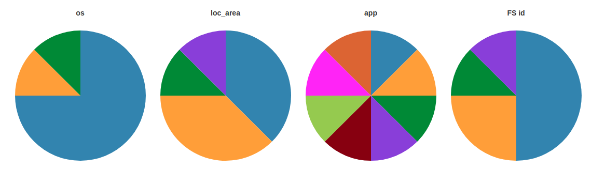

# Go Cross Filter



## Table of Contents

* [Overview](#overview)
* [Dependencies](#dependencies)
* [Getting Started](#getting-started)
* [Usage](#usage)

## Overview

[**Axibase Cross Filter**](https://apps.axibase.com/cross-filter/?table=Linux%20Performance) is a Go-language application that implements the [cross-filter concept](https://square.github.io/crossfilter/) for use with data stored in [Axibase Time Series Database](https://axibase.com/docs/atsd/). The Cross Filter application provides the capability to apply graphical filters to entity tags and time series retrieved from ATSD, without reloading data on the client. Datasets are loaded from ATSD using [SQL queries](https://axibase.com/docs/atsd/sql/sql-console.html) and refreshed on a schedule. Cross Filter uses [`cross-filter.js`](https://square.github.io/crossfilter/) and [`datatables`](https://www.datatables.net/) to build and maintain indices for high speed client-side filtering. Filters are displayed by the application using widgets from the [Axibase Charts Library](https://github.com/axibase/charts/blob/master/README.md#axibase-charts).

## Dependencies

Client:

1. Bootstrap `3.3.5`
2. jQuery `2.1.4`
3. D3.js `3.5.6`
4. DataTables `1.10.9`
5. DataTables Scroller `1.3.0`
6. Crossfilter `1.3.12`

Server:

1. ATSD Revision more current than `11130`
2. Go dependencies from [Godeps.json](./Godeps/Godeps.json)  

## Getting Started

### Requirements

1. Go Language [Build Tools](https://golang.org/pkg/go/build/)
2. Go Dependency Management Tool [`dep`](https://github.com/golang/dep)

### Install

Navigate to your destination folder and execute the following commands:

Load last version from github repository:
```bash
# Load last version from github repository
go get github.com/axibase/go-capacity-screener

# Compile the project:
godep go build
```

## Usage

Default program structure is enumerated below:

```text
.
|-- config.json                   - Capacity Screener configuration file
|-- go-capacity-screener          - Capacity Screener binary
|-- templates                     - Web page templates
|   |-- index.tpl
|   `-- view.tpl
`-- portals                       - User defined portals folder
    |-- itcam-rtt.conf
    |-- nmon.conf
    `-- oracle_databases.conf
```

### Edit Configuration Files

Define ATSD URL, username and password:

```bash
{
  "url": "http://atsd_server:8088",   #define ATSD access credentials
  "user": "username",
  "password": "password",
  "port": 8000,                       #application web view port
  "updatePeriod": "1m",               #interval used to update all defined tables
  "tables": [
  ...                                 #define tables here
  ]
}
```

Define tables:

```bash
...
"tables": [
  {
      "name": "Linux Performance",                                 #table name                               
      "entityGroups": ["nmon-linux", "nurswg-dc1", "nurswg-dc2"],  #which entity groups can be used to filter the table(dataset) 
      "sqlQuery": ATSD_SQL_QUERY,                                  #SQL query to load data from ATSD
      "portalConfigPath": "portals/linux_performance.config",      #portal configuration file
      "columns": [                  #all column names should match aliases in sqlQuery.
        {
          "name": "entity",                  
          "entity": true            #entity column flag (only one per table) to view the portal
        },
        {
          "name": "os",             
          "filter": {}            #filter object to use column for a visual filtering.
        },
        {
          "name": "loc_area",
          "filter": {}
        },
        {
          "name": "app",
          "filter": {}
        },
        {
          "name": "FS id",
          "filter": {}
        },
        {
          "name": "Cpu Busy, %",
          "filter": {
            range: [0, 100]         #range option to set histogram range for numeric columns
          },
          "formatter": {            #specify formatter for numeric columns to render column value based on formula (round(multiplier * value))
            "round": 1              #you can specify "round" and "multiplier" independently.
          }
        },
        {
          "name": "Memory Used, %",
          "filter": {
            range: [0, 100]
          },
          "formatter": {
            "round": 1
          }
        },
        {
          "name": "Memory Free, Mb",
          "filter": {},
          "formatter": {
            "round": 0,
            "multiplier": 0.00097656  #converting bytes to Mb
          }
        },
        {
          "name": "FS used, %",
          "filter": {
            range: [0, 100]
          },
          "formatter": {
            "round": 1
          }
        }
      ]
  },
  ...
]
```

#### Launch the Application

```bash
./go-cross-filter
```